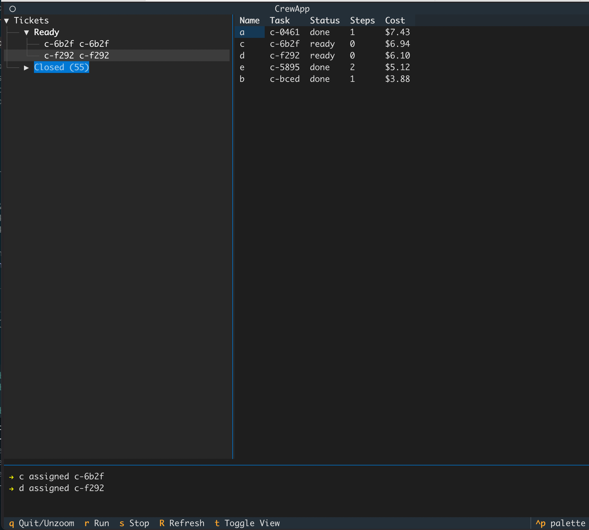
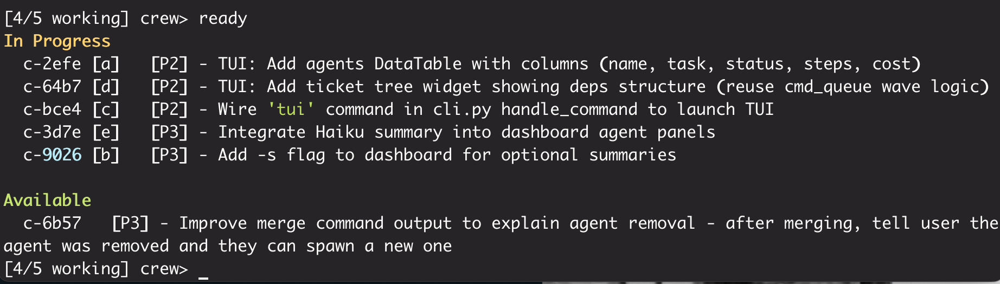

# crew

Multi-agent orchestrator for Claude Code.

## Overview

`crew` orchestrates multiple Claude Code agents working on the same codebase. Each agent runs in its own git worktree, with its own session, working on assigned tasks.




```
┌─────────────────────────────────────────────────────────────┐
│                        crew                                 │
├─────────────────────────────────────────────────────────────┤
│  REPL UI          State Manager       Agent Runner          │
│  - prompt         - agents.json       - spawn/step/cleanup  │
│  - commands       - ticket ops (tk)   - claude --print -r   │
│  - display        - session IDs       - output capture      │
└─────────────────────────────────────────────────────────────┘
                              │
              ┌───────────────┼───────────────┐
              ▼               ▼               ▼
         agents/alpha    agents/beta    agents/gamma
         (worktree)      (worktree)     (worktree)
```

## Installation

```bash
cd /path/to/crew
pip install -e .
```

## Prerequisites

- Python 3.11+
- Claude Code CLI (`claude`)
- [`ticket`](https://github.com/wedow/ticket#) (`tk`) for issue tracking
- Git

## Usage

First, create tickets using [`tk`](https://github.com/wedow/ticket#):

```bash
tk create "Add user authentication"
tk create "Write auth tests" --dep c-xxxx  # depends on auth ticket
tk create "Update API docs"
```

Then run crew to orchestrate agents:

```bash
cd your-project
crew
```

Inside crew, spawn workers and run:

```bash
crew> spawn 3        # spawn 3 workers (named a, b, c)
✓ Created 3 workers: a, b, c

crew> run            # auto-assign ready tickets and run
  ▶ a assigned c-xxxx
  ▶ b assigned c-yyyy
  → a: Starting work on authentication...
  → b: Updating API docs...
  ✓ b completed c-yyyy
  ✓ Merged agent/b-c-yyyy to main
  ✓ a completed c-xxxx
  ✓ Merged agent/a-c-xxxx to main
  ▶ a assigned c-zzzz   # auto-picks up unblocked ticket
  ...
```

### Commands

| Command | Description |
|---------|-------------|
| `d`, `s`, `status`, `dashboard` | Show dashboard with agents and status |
| `spawn <n>` | Create n idle workers (auto-named a, b, c...) |
| `spawn <name> [task]` | Create named worker, optionally with task |
| `run` | Auto-assign tasks and run all agents |
| `stop` | Stop the runner, pause agents |
| `ready`, `r` | Show ready tickets (from tk) |
| `queue`, `q` | Show full ticket queue with waves |
| `peek <name>` | Show agent's recent output |
| `logs <name>` | Show log directory |
| `ps` | Show running claude processes |
| `kill <name>` | Stop agent, keep worktree |
| `cleanup <name>` | Remove agent and worktree |
| `merge <name>` | Merge agent's branch to main |
| `new <title>` | Create ticket (via tk) |
| `dep <ticket> <blocker>` | Add dependency between tickets |
| `assign <name> <id>` | Manually assign ticket to agent |
| `reset <commit>` | Reset everything to a git commit |
| `clean` | Wipe all crew state |
| `help`, `h` | Show commands |
| `quit`, `exit` | Exit crew |

## How It Works

1. **Spawn**: Creates a git worktree + writes CLAUDE.md with task instructions
2. **Step**: Runs `claude --print --resume <session>` to continue agent's work
3. **Done**: When agent outputs "DONE", auto-merges branch to main
4. **Logs**: All Claude output logged to `.crew/logs/<agent>/`

## File Structure

```
your-project/
├── .crew/
│   ├── state.json       # Agent registry
│   └── logs/
│       └── alpha/
│           ├── 001-init.log
│           └── 002-step.log
├── agents/              # Git worktrees
│   └── alpha/
│       └── CLAUDE.md
└── .tickets/            # ticket storage
```

## Example Session

```
$ crew

╭─────────────────────────────────────╮
│ crew — multi-agent orchestrator     │
╰─────────────────────────────────────╯

crew> spawn alpha mp-auth
✓ Created agent alpha on mp-auth

[1 active] crew> status
Agents:
  ● alpha: mp-auth (working, 1 steps, 2m)

Ready Work:
  mp-test [P2] blocked on mp-auth

[1 active] crew> run
→ Stepped alpha (step 2)
→ Stepped alpha (step 3)
✓ alpha completed mp-auth
✓ Merged agent/alpha to main

crew> status
No agents.

Ready Work:
  mp-test [P2] - Write auth tests

crew>
```
